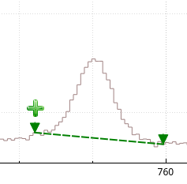
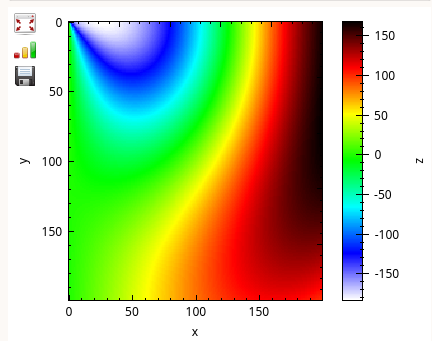
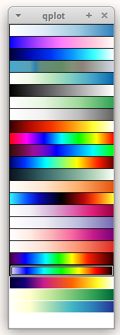

# QPlot
A library of for scientific plotting with Qt Widgets / C++.

Contains the following:

* Simple containers for list- and map-based histograms (QHist.h)
* KnightRiderWidget for scalar value visualization
   
* [qcustomplot](https://www.qcustomplot.com/) (v2.1.0)
* Convenience classes based on qcustomplot
    - QPlot1D for 1-dimensional histogram widgets
    - QPlotDraggable for selecting points and ranges in 1d plots
     
    - QPlot2D for colormap widgets
     
    - GradientSelector widget with visualization for color map gradients
     

A conan package of the library is available on the
[ESS Artifactory](https://artifactory.esss.lu.se/artifactory/ecdc-conan-release/).

Apologies for the lack of documentation. You can build doxygen API docs with `make api_doc`,
though there is little in terms of descriptions. The [test](test) subdirectory contains some
interactive examples of how each widget is to be used. You can also glean examples of usage in
the following projects that make extensive use of this library:
* [daquiri](https://github.com/ess-dmsc/daquiri)
* [events-nmx-classify](https://github.com/ess-dmsc/events-nmx-classify)
* [qpx-gamma](https://github.com/usnistgov/qpx-gamma)

